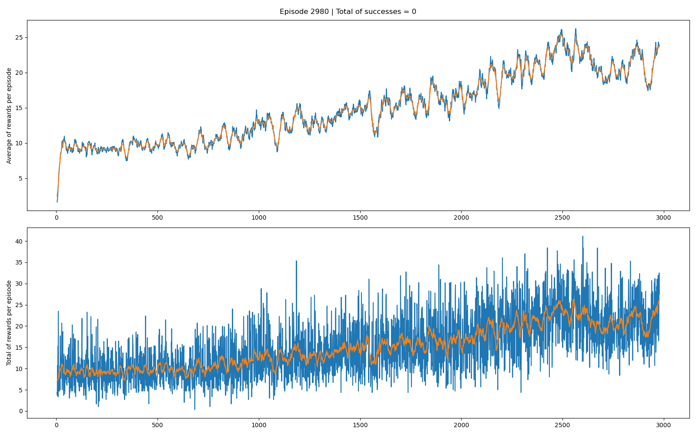
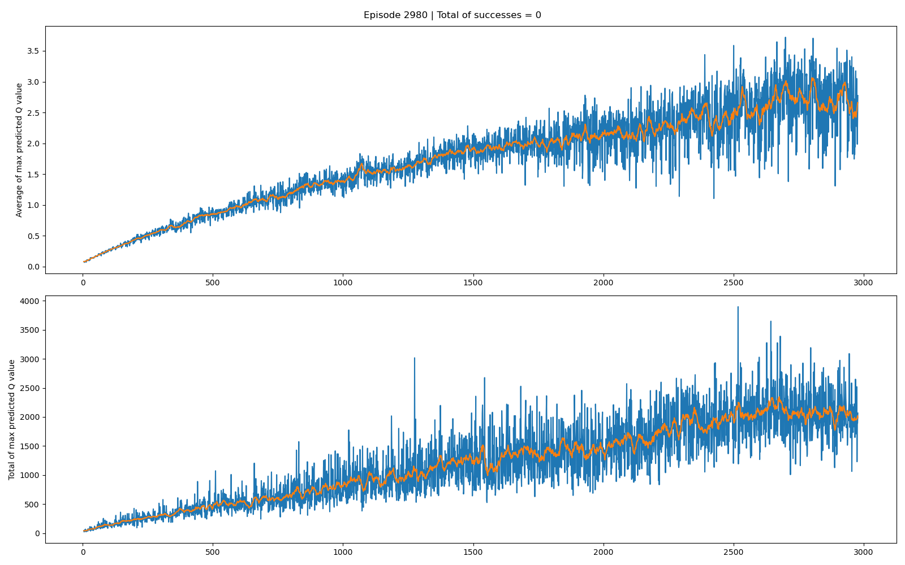

# Deep Q-Network on the Atari Game Ms-Pacman

<p align="center">
  
</p>

## Basic information

The goal of this project is to apply the **Deep Q-Network** algorithm on Ms-Pacman environment and to reach good performance without using prioritized replay memory or better DQN namely _A3C_ or _Rainbow DQN_.
Following results were obtained with following parameters :

| Parameter          | Value               |
| ------------------ | ------------------- |
| Batch size         | `128`               |
| Discount rate      | `0.99`              |
| Epsilon max        | `1.0`               |
| Epsilon min        | `0.1`               |
| Epsilon decay      | `1,000,000`         |
| Target update      | `8,000`             |
| Replay memory size | `18,000`            |
| Optimizer          | SGD with momentum   |
| Learning rate      | `2.5e-4`            |
| Momentum           | `0.95`              |
| Positive reward    | `log(reward, 1000)` |
| Negative reward    | `-log(20, 1000)`    |

## Performances

### Rewards

Default rewards follow a large range. To standardize rewards, the logarithm function is applied on reward given by the environment (see the function `transform_reward` in `utils/utils.py`).

```python
from math import log
def transform_reward(reward):
    return log(reward, 1000) if reward > 0 else reward
```

Also a negative reward is given to the agent when a ghost eats the agent. On the top of the following figure, the average reward is computed on the 20 latest episodes :

```python
import statistics
def mov_avg(self, t):
    # t = 20
    values = (
	[0] * (t - len(self._total)) + self._total
	if len(self._total) < t
	else self._total[-t:]
    )
    self._mean.append(statistics.mean(values))
```



### Q-value

The behavior of the agent becomes better when the Q-value improves over the time.



### Results

#### Smart behavior

The agent is able to avoid chasing ghosts

<p align="center">
  
</p>

#### High score

The agent eats pills and eats ghosts after having gotten a boost. 

<p align="center">
  
</p>

## For installation

All installation will be done in Docker

## For usage

### Training part

#### Train the agent

In `deep_Q_network` folder, you can find the file `parameters.py` where parameters are set. After checking them, you can run the training with the following command line

```sh
source docker_run.sh
# python3 main.py
```

#### Train and save evolution step by step (a lot of memory)

To save the evolution step by step, simply run:
```sh
# python3 main.py --image
```


#### Dynamic display

This mode is useful when you want to see how the agent reacts and interacts with its environment.

To display the "dashboard", simply run :
```sh
# python3 main.py --stream
```
Then enter the URL `localhost:5000` in your browser.


**Note :**: It is recommended for a long training to not use this mode.

### Evaluation

#### Location of saved data

When you run `main.py`, it will automatically create a folder `results` in where all results will be stored.

#### Usage

By default, the evaluation from `eval.py` is on the most recent **folder** and **episode**.
To specify them :
```sh
# python3 eval.py -e 120 --path ./results/mytrainingfolder
```
You can find different flags to get what you want :
- by default, it saves a plot with Q values, rewards and the last losses of desired episode.
- `--reward`, it saves rewards with a pseudo moving average
- `--qvalue`, it saves Q values with a pseudo moving average
- `--record`, it records the agent interaction
- `-a` or `--all`, it records the agent interaction and save plots


## Structure of the code
```
.
├── deep_Q_network
│   ├── __init__.py
│   ├── buffer.py # buffer class used for websocket and for tracking training performances
│   ├── memory.py # replay memory
│   ├── model.py # dueling DQN and optimization (see the class for more details)
│   ├── parameters.py # all parameters except how rewards are managed
│   └── preprocessing.py # for preprocessing observations
├── docs
│   └── ...
├── evaluation # only use by `eval.py`
│   ├── __init__.py
│   ├── parser.py
│   └── utils.py
├── utils
│   ├── __init__.py
│   ├── actions.py
│   ├── opencv.py
│   ├── parser.py
│   ├── path.py
│   ├── rewards.py
│   └── save_functions.py
├── results
│   └── training-[...]
│       ├── models # folder with pytorch models
│       │   ├── policy-model-[...].pt
│       │   └── target-model-[...].pt
│       ├── plots # folder for `python main.py --image` command
│       │   └── episode-[...].png
│       ├── recorded-data # folder with pickle files
│       │   └── episode-[...].pkl
│       ├── output_video.avi
│       ├── q_values.png
│       ├── result.png
│       └── rewards.png
├── eval.py # to evaluate the agent
├── main.py # to train the agent
├── README.md
└── requirements.txt
```
# uplaod
